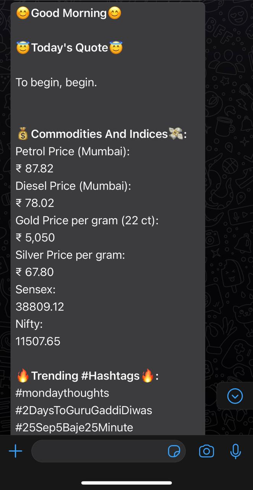
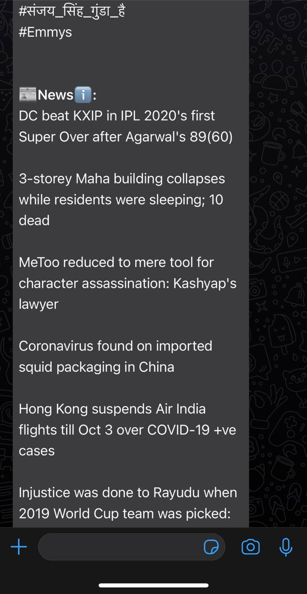
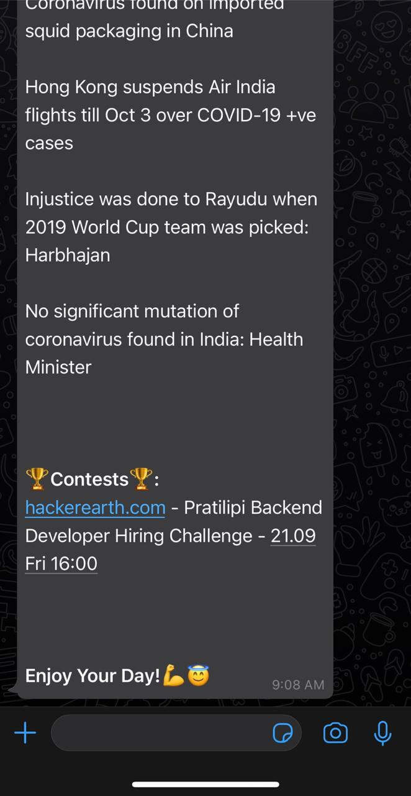

# Whatsapp Automation
> Automated whatsapp messages are sent to specified users at specified time about essential news/prices and quotes to make    user's morning productive
<!-- > Live demo [_here_](https://www.example.com). If you have the project hosted somewhere, include the link here. -->

## Table of Contents
* [General Info](#general-information)
* [Technologies Used](#technologies-used)
* [Features](#features)
* [Screenshots](#screenshots)
* [Setup](#setup)
* [Usage](#usage)
* [Project Status](#project-status)
* [Room for Improvement](#room-for-improvement)
* [Contact](#contact)
<!-- * [License](#license) -->

## General Information
- This is an automation script written in python that uses various python libraries and methods to fetch essential information and cast it in a beautiful message and send it to user every morning or at any specified time without any manual intervention 
- This makes user not to miss out on any essential information and updates as well as makes user more aware 
- Also many start their day with social media, which can be bad sometimes, so it helps to tackle that situation too as most use whatsapp everyday as well as go through messages every morning, so it would give an aware headstart to user's day
<!-- You don't have to answer all the questions - just the ones relevant to your project. -->

## Technologies Used
- Python (For automated scripts)
- Twilio (For sending messages)
- Details of the libraries is mentioned in `requirements.txt`

## Features
These are some of the features available currently:
- Easy to tweek
- Can change the information to be sent
- Can add multiple nos easily
- Ready for deployment on Heroku (Procfile configured)

## Screenshots
Below are some screenshots of the project:

<!-- If you have screenshots you'd like to share, include them here. -->

## Setup
One needs to configure twilio and enter their account sid, auth token, provided no and receiver no in `Send_msg.py`
Also one needs to enter time interval in `clock.py`

## Usage
Following python command does the work

`python clock.py`

## Project Status
Project is:  _Complete_ 

## Room for Improvement

Room for improvement:
- Can include a dashboard for the same integrated with flask and UI as well as no for specific information that is to be sent 

## Contact
Created by [@Shriram Pareek](https://github.com/Shrirampareek888) - feel free to contact me!

<!-- Optional -->
<!-- ## License -->
<!-- This project is open source and available under the [... License](). -->

<!-- You don't have to include all sections - just the one's relevant to your project -->
